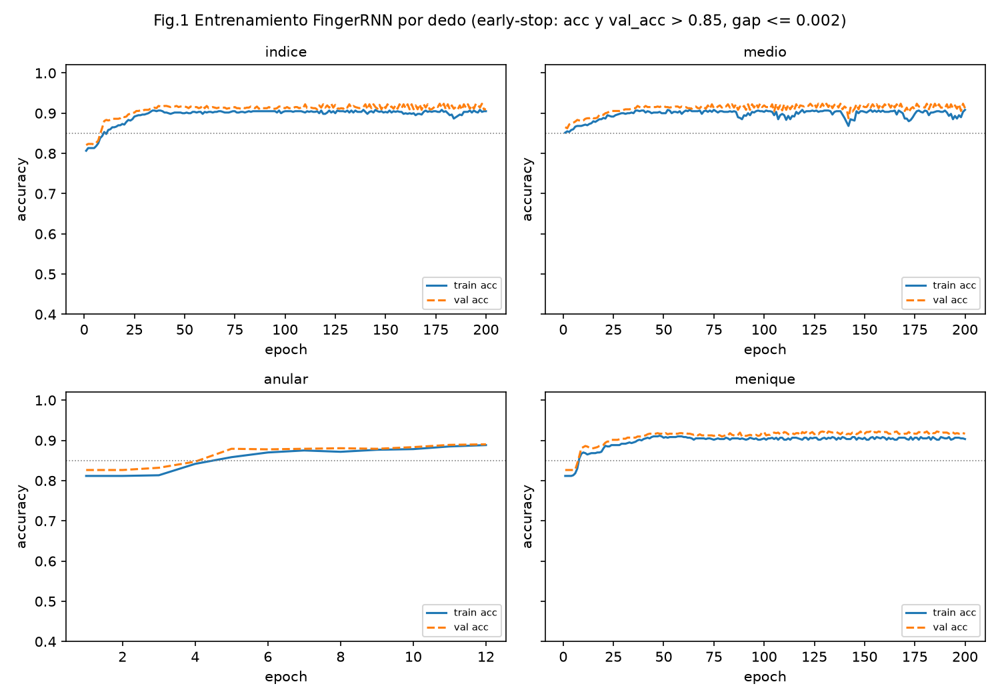
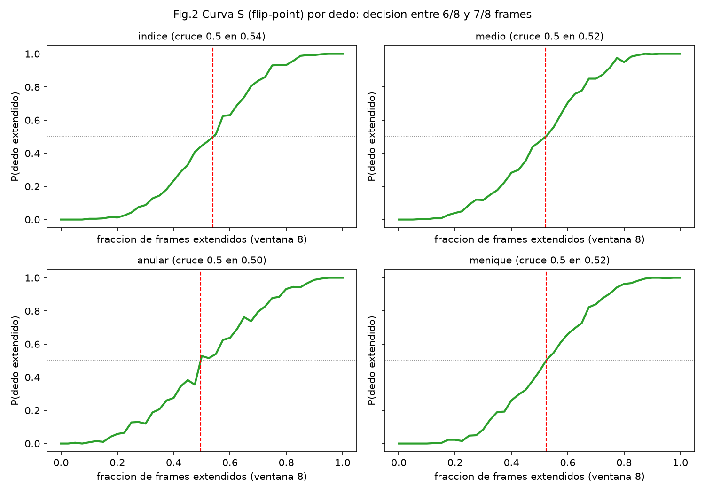
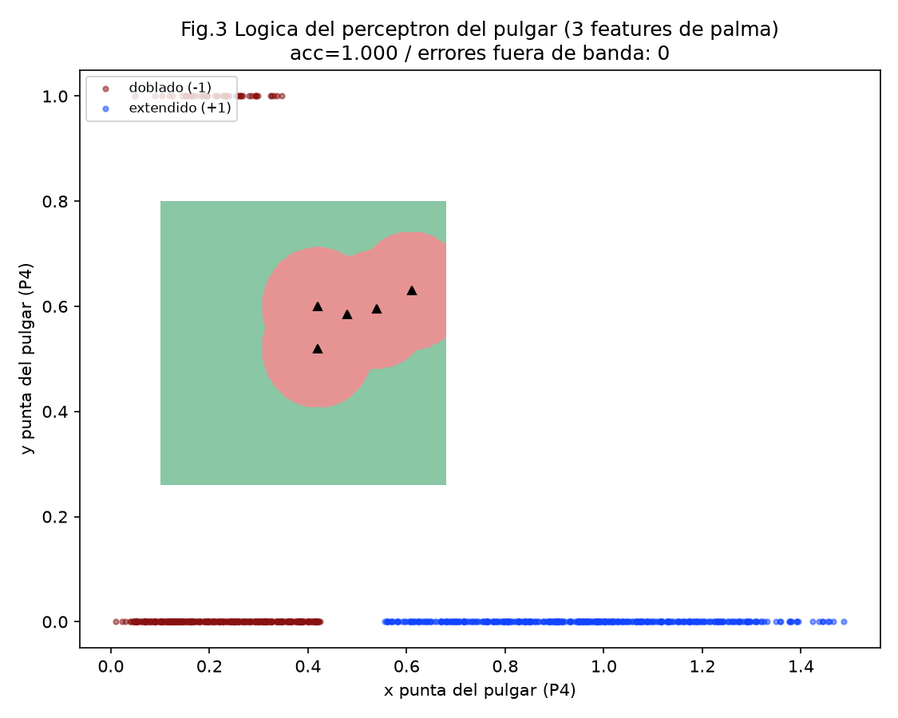
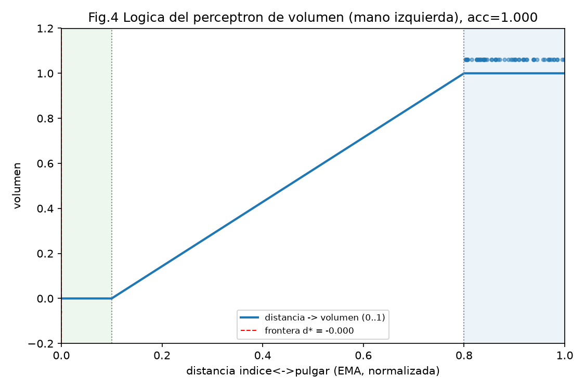
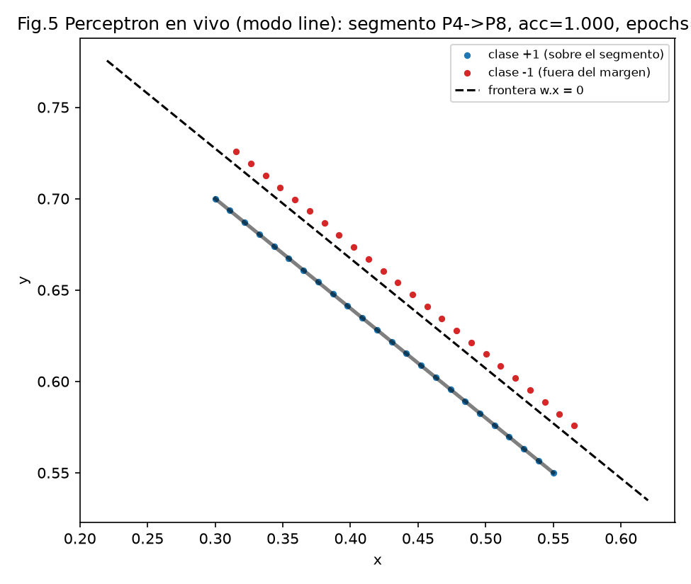

# Informe tecnico — the-machine

Deteccion de manos y gestos en tiempo real con MediaPipe y OpenCV, con una interfaz de estilo "Grecia antigua / EPIC: The Musical". El sistema usa un reproductor de musica (EPIC) controlado por la mano derecha (4 RNN, una por dedo no-pulgar, + un Perceptron para el pulgar) y volumen por la mano izquierda (Perceptron), mas un Perceptron en vivo en el modo line.

El documento esta organizado segun los criterios de evaluacion, en este orden:

1. **Modelo correctamente implementado** (entrenamiento correcto, sin underfitting/overfitting).
2. **Implementación técnica** (estructura, técnicas ML/DL e hiperparámetros).
3. **Evaluacion y metricas** (justificación de metricas, tablas y gráficos).
4. **Resultados y visualizaciones** (gráficas por dedo + logica del perceptrón).

Todas las cifras de este informe son reproducibles: el entrenamiento y la evaluación usan semillas fijas (datos `7`, inicialización `seed=idx` por dedo, epocas `42`, test independiente `99`), y los pesos versionados en `models/finger_*.npz`, `models/thumb.npz` y `models/volume.npz` son exactamente los que producen los resultados de las secciones 3 y 4.

---

## 1. Modelo correctamente implementado

### 1.1 Modelos entrenados

| Modelo | Tipo | Rol | Entrada (features) | Pesos |
|--------|------|-----|--------------------|-------|
| `FingerRNN` x4 (indice, medio, anular, menique) | RNN Elman apilada (NumPy, BPTT) | decide si cada dedo esta extendido sobre la ventana temporal | binaria ±1 del dedo en 8 frames | `models/finger_1..4.npz` |
| `thumb` | Perceptron binario | decide pulgar doblado/extendido por frame | 3 features de palma `[d_near, inside, bias]` | `models/thumb.npz` |
| `volume` | Perceptron binario | clasifica pinza cerca/lejos (mano izquierda) | 2 features `[-d, bias]` | `models/volume.npz` |
| `line` | Perceptron binario en vivo | separa la linea pulgar↔indice (modo line) | `[x, y, bias]` | entrenado en vivo |
| MediaPipe `hand_landmarker.task` / `gesture_recognizer.task` | modelos preentrenados | percepcion: 21 landmarks / 8 gestos | imagen | `models/*.task` |

MediaPipe aporta la percepcion (landmarks); la decision (conteo, acciones, volumen) es propia y se entrena "en casa" sin frameworks de deep learning.

### 1.2 FingerRNN: arquitectura y entrenamiento

- **Arquitectura**: RNN simple tipo **Elman apilada**, 2 capas ocultas con `hidden=8` por capa (`h_l = tanh(Wx_l·in_l + Wh_l·h_l + b_l)`), dropout 0.3 por capa (solo entrenamiento) y capa de salida softmax de 2 clases (plegado=0 / extendido=1). Una Red Neuronal Recurrente ELMAN por dedo (indice→1, medio→2, anular→3, menique→4).
- **Entrada**: la feature binaria (±1) del dedo a lo largo de una ventana temporal de **8 frames**. La RNN actua como filtro temporal: ignora parpadeos de 1-2 frames.
- **Datos**: ventanas sinteticas por polos — clase plegado en p=0.00/0.20/0.42 de frames extendidos, clase extendido en p=0.65/0.82/1.00 (100 ventanas por grupo de train, 120 por grupo de validacion), con noise gaussiano sigma 0.12.
- **Optimizacion**: BPTT (backpropagation through time) con descenso de gradiente (lr=0.08), cross-entropy con softmax, early-stop: `acc > 0.85`, `val_acc > 0.85` y `|acc - val_acc| <= 0.002` (max 200 epochs).
- **Reproducibilidad**: generador de datos con semilla 7, inicializacion con semilla fija por dedo (`seed=idx`), epocas con generador 42. Repetir `HandController.train_all()` produce pesos idénticos a los versionados.

### 1.3 Perceptron del pulgar

- **Features** (por frame, normalizadas por la escala de la mano `hand_scale`): `d_near` = distancia minima de la punta del pulgar (P4) a los puntos de la palma `{5,7,9,13,17}`; `inside` = 1 si P4 cae dentro del cuadrilatero de palma `(5,17,1,9)`; bias `1.0`.
- **Datos**: polos sinteticos — doblado (-1) si P4 dentro del cuadrilatero o a `< 0.10` de la palma, extendido (+1) si `> 0.13` y fuera (400 por clase, semilla 13). El problema queda **linealmente separable**.
- **Resultado**: converge en 2 epochs con **accuracy 1.000**; pesos `w = [0.1033, -0.05, -0.05]`. La regla de decision `w·x >= 0` significa: a mayor distancia de la palma (paso de 0.10 a 0.43+) el pulgar pasa a "extendido"; estar dentro del cuadrilatero empuja a "doblado".
- **Suavizado temporal**: en el conteo el pulgar se decide por **mayoria sobre los 8 frames** de la ventana; si faltan pesos cae al fallback geometrico (coseno + padding).

### 1.4 Perceptron de volumen (mano izquierda) y del modo line

- **Volumen**: perceptron de 2 features `[-d, bias]` sobre la distancia indice↔pulgar normalizada `index_thumb_distance`; clasificador cerca(-1)/lejos(+1) con datos sembrados en `near=0.10` y `far=0.80` (semilla 11). Converge con **accuracy 1.000** (`w = [0.0369, 0.0]`): cualquier distancia ya es clasificable; el valor continuo de volumen se produce interpolando la salida `w·x` entre `near` y `far` (0..1), con un **EMA** de factor 0.35 para atenuar temblores (seccion 4.4).
- **Line**: perceptron de 3 features `[x, y, bias]` entrenado en vivo con 24 puntos sobre el segmento P4→P8 y 24 desplazados perpendicular `margin=0.03`; presupuesto de 200 epochs por frame, converge en un numero bajo de epochs con **accuracy 1.000** (seccion 4.5).

### 1.5 Analisis underfitting/overfitting (evidencia)

Las metricas completas estan en la seccion 3; los hechos clave que descartan ambos extremos son:

- **No underfitting**: los 4 FingerRNN superan el objetivo de accuracy sobre train y validacion (train 0.888-0.908, val 0.890-0.917 > 0.85); el pipeline completo de conteo de gestos (0..5) da 6/6 = **1.000** y los tres perceptrones alcanzan **1.000**. El feature engineering (coseno de flexion por dedo, seccion 2.5) deja el problema lineal/recurrente facilmente separable en los polos.
- **No overfitting**: el gap `|train_acc - val_acc|` es <= 0.013 en los 4 dedos (maximo en menique: 0.0133, dentro del ruido de muestreo entre splits); en 3 de 4 dedos la precision de validacion es igual o mayor que la de entrenamiento (0.910 vs 0.905, 0.912 vs 0.908, 0.917 vs 0.903). Ademas, un **test independiente nunca visto** (semilla 99) reproduce la validacion (0.883-0.906, tabla 3.3), lo que confirma generalizacion y no memorizacion.
- El accuracy se estabiliza en la meseta ~0.90 para todos los dedos, comportamiento esperado con **dropout 0.3**: la capacidad del modelo (2 capas x hidden 8) es holgada frente a la tarea y el dropout regulariza; el error restante se concentra en la banda ambigua de transicion (p=0.42/0.65, tabla 3.4), que es solapamiento de clases intrinseco del dataset sintetico, no bajo-ajuste del modelo.
- El early-stop con margen doble (0.002 en la primera corrida) puede dispararse en la fase ascendente si la meseta se alcanza rapidamente (anular paro en 12 epochs con `acc=0.888`); con `target=0.95, gap=0.004` los mismos datos y semillas llevan a mesetas equivalentes (0.903-0.908 / 0.910-0.924, gap <= 0.0203) sin penalizar el pipeline (gestos 6/6). Ambas configuraciones quedan documentadas y son reproducibles con la misma llamada `HandController.train_all(target=..., gap=...)`.

---

## 2. Implementación técnica

### 2.1 Arquitectura en capas

```
main.py              → fachada minima (parsea args → app.runner.run)
app/                 → orquestacion: registry, vision, runner
presentation/        → UI: modes/ (hand|line|position|music) + ui/ (theme|layout|drawing|effects|greek)
controllers/         → gesto→accion: hand.py (FingerRNN x4), thumb.py (ThumbPerceptron), gestures.py (MusicGestureController), volume.py (VolumeController)
core/                → dominio puro: fingers, perceptron, results, gestures, handedness, playlist
config/              → configuracion (palette, strings, settings — dataclasses tipadas)
common/              → transversal (fps)
infrastructure/      → adapters: capture (camara), display (ventana pygame), player (pygame.mixer)
models/              → .task de MediaPipe + finger_1..4.npz + thumb.npz + volume.npz
music/               → sagas mp3 (EPIC: The Musical)
docs/                → documentacion por capa e informe tecnico (este archivo)
```

Reglas de dependencia (bajo): `core` nunca importa `presentation` ni `infrastructure`; `config/common` son hojas; `presentation` no toca `infrastructure`; el gesto→accion viaja de forma diferida (`.pending`) que el runner consume. Esto hace al dominio puro testeable sin camara.

| Capa | Modulo | Responsabilidad |
|------|--------|-----------------|
| Fachada | `main.py` | parsear argv y delegar en `app.runner.run`. |
| Aplicacion | `app/runner.py` | bucle principal, ExitStack para limpieza, dispatch de acciones/volumen. |
| Aplicacion | `app/vision.py` | factory de `HandLandmarker`/`GestureRecognizer`. |
| Presentacion | `presentation/modes/*.py` | un `draw(frame, results)` por modo; `music.py` no conoce infrastructure. |
| Presentacion | `presentation/ui/*.py` | tema griego, sidebar, bbox/skeleton, crosshair, motivos grecos. |
| Controladores | `controllers/hand.py` | `FingerRNN` (Elman apilada + BPTT + dropout) y `HandController` (count/action/train/save/load). |
| Controladores | `controllers/thumb.py` | `ThumbPerceptron`: dataset de palma, load_or_train, decision por frame. |
| Controladores | `controllers/gestures.py` | ventana temporal, agreement, settle, rate-limit, `pending`. |
| Controladores | `controllers/volume.py` | perceptron volumen, mapeo 0..1, EMA, load_or_train. |
| Dominio | `core/fingers.py` | features por dedo, umbrales, `hand_scale`, distancias pinza. |
| Dominio | `core/perceptron.py` | clase `Perceptron` (train, train_budget, reset) y `build_dataset` del modo line. |
| Dominio | `core/results.py`, `handedness.py`, `playlist.py` | helpers de resultados, flip Left↔Right por espejo, escaneo de sagas. |
| Infraestructura | `capture/display/player` | cámara, ventana, audio (`MusicPlayer` sobre pygame.mixer con degradación sin audio). |

### 2.2 Flujo de datos por frame (rama music)

```
Webcam (flip + resize 1060x720) → BGR→RGB + reescalado inferencia (60%)
  → HandLandmarker (21 landmarks)
  → features: coseno de flexion por dedo (4) + Perceptron de palma (pulgar) + hand-sign
mano derecha : ventana de 8 frames → MusicGestureController (agreement 4, settle 0.45s, rate-limit 1.5s)
               → HandController.count (mayoria pulgar + 4 RNN) → accion 0..5 → player
mano izquierda: index_thumb_distance → VolumeController (perceptron + EMA) → volumen 0..1 → player
```

### 2.3 Calidad de codigo

- **Modular**: un concepto por modulo en cada capa; modelos serializables; el training es una llamada (`HandController.train_all`).
- **Comentado y tipado**: type hints en el 100% de los modulos; `dataclasses(slots=True, frozen=True)` para configuracion; tipos NumPy (`NDArray`).
- **CI en GitHub Actions** (`.github/workflows/ci.yml`, Ubuntu + Windows): `ruff` (lint), `black` (formato, line-length 100), `mypy` (tipos), `compileall` y `pytest` (smoke tests de playlist, volumen y zona efectiva).

### 2.4 Tecnicas de Machine/Deep Learning aplicadas

| Tecnica | Donde | Para que |
|---------|-------|----------|
| Perceptron (regla de Rosenblatt, ±1, actualizacion `w += lr·y·x`) | pulgar, volumen, line | clasificacion binaria en tiempo real |
| RNN Elman apilada manual en NumPy + BPTT | FingerRNN x4 | suavizado temporal y clasificacion de ventanas |
| Dropout (0.3, solo entrenamiento) | FingerRNN | regularizacion anti-overfitting |
| Early stopping con split train/val | FingerRNN | parada al converger, gap acotado |
| Softmax + cross-entropy | FingerRNN (sin frameworks) | clasificacion de 2 clases |
| Hiperparametros por dataclass | `config/settings.py` | lr, epochs, margenes, near/far, EMA — una sola fuente de verdad |
| Feature engineering geometrico | `core/fingers.py` | coseno de flexion por articulacion, invariante a rotacion |
| Normalizacion por escala de mano | `hand_scale` | distancias medidas en units de mano, no de imagen |
| EMA (exponential moving average) | volumen | suavizado de la senal continua |
| Suavizado por mayoria / ventana | pulgar, conteo | filtra parpadeos de 1-2 frames |
| Estados de confirmacion temporal | `MusicGestureController` | agreement(4) + settle(0.45s) + rate-limit(1.5s) + anti-repetición |
| Semillas fijas por etapas | data/init/epoch/test | resultado determinista y reproducible |

### 2.5 Features de entrada y fine-tuning por dedo

La extension de cada dedo (excepto pulgar) se mide como el **coseno del angulo de flexion** en PIP entre los segmentos `MCP→PIP` y `PIP→TIP`: recto → `cos ≈ 1`, doblado → `cos <= 0`. Es invariante a la rotacion de la mano y normalizado por construccion. Umbrales afinados por dedo (fine-tuning):

| Dedo | Landmarks (MCP→PIP→TIP) | Umbral de coseno | Nota |
|------|--------------------------|------------------|------|
| Pulgar | 2 → 3 → 4 | 0.50 | hoy decide el Perceptron de palma; coseno queda como fallback |
| Indice | 5 → 6 → 8 | 0.45 | |
| Medio | 9 → 10 → 12 | 0.45 | |
| Anular | 13 → 14 → 16 | **0.35** | permisivo: limitacion anatomica (tendones compartidos con menique en el gesto de 3) |
| Menique | 17 → 18 → 20 | 0.45 | exigente |

El pulgar usa 3 features de palma (seccion 1.3) en el lugar de un RNN, que resuelve mejor el pulgar recogido sobre la palma (doblado) frente al pulgar salido (extendido). El "hand-sign" (orientacion muñeca→MCP medio) acompana la ventana pero no participa en el conteo.

---

## 3. Evaluacion y metricas

### 3.1 Justificacion de las metricas

| Metrica | Definicion | Por que se usa aquí |
|---------|------------|---------------------|
| **Accuracy (train) vs Accuracy (validacion)** | aciertos sobre los splits tr/va | El gap entre ambas es el indicador principal de overfitting: si el modelo memorizara train, val caeria y el gap creceria. |
| **Accuracy en test independiente** | semilla 99, 720+ ventanas nunca vistas | Confirma generalizacion sin sesgo de reutilizar train/val. |
| **Precision / Recall / F1 por dedo** | sobre la clase "dedo extendido" | Un falso positivo = un dedo de mas (accion equivocada); un falso negativo = dedo perdido. Ambos importan, por eso se reportan los tres y su F1. |
| **Accuracy por grupo p** | fraccion de frames extendidos en la ventana | Diagnostico: los polos deben ser perfectos y la banda de transicion (0.42/0.65) concentra el error esperable por solapamiento de clases. |
| **Flip-point (curva S)** | p donde `P(extendido)` cruza 0.5 | Mide la frontera sensorial del suavizado temporal por dedo (grafica por dedo en Fig.2). |
| **Accuracy end-to-end por gesto** | pipeline completo (pulgar por mayoria + 4 RNN), 200 ventanas/gesto | Metrica de producto: el conteo 0..5 debe ser correcto con el pulgar incluido. |
| **Accuracy / rejilla de decision** | perceptrones del pulgar y volumen | Verifican la separacion lineal en todo el espacio de operacion (para el pulgar: 37,249 posiciones de P4). |

### 3.2 Metricas de entrenamiento por dedo (early-stop 0.85 / gap 0.002, max 200)

| Dedo | Epochs | Train acc | Val acc | Gap |
|------|--------|-----------|---------|-----|
| indice | 200 | 0.905 | 0.910 | 0.0047 |
| medio | 200 | 0.908 | 0.912 | 0.0042 |
| anular | **12** | 0.888 | 0.890 | 0.0019 |
| menique | 200 | 0.903 | 0.917 | 0.0133 |

El anular es el unico que activa el early-stop (meseta alcanzada en 12 epochs con gap 0.0019 <= 0.002). Con la variante estrita (0.95/0.004) los cuatro entrenan completo y llegan a `val_acc` 0.910-0.924, misma meseta y gestos 6/6 (seccion 3.6).

### 3.3 Metricas en test independiente (semilla 99, 720 ventanas por dedo)

| Dedo | Test acc | Precision | Recall | F1 |
|------|----------|-----------|--------|-----|
| indice | 0.901 | 0.907 | 0.894 | 0.901 |
| medio | 0.906 | 0.895 | 0.919 | 0.907 |
| anular | 0.883 | 0.875 | 0.894 | 0.885 |
| menique | 0.904 | 0.910 | 0.897 | 0.903 |

Precision ≈ recall ≈ F1 ≈ accuracy ⇒ los errores estan equilibrados entre clases, no hay sesgo hacia "todo extendido" ni "todo doblado".

### 3.4 Accuracy por grupo p (una vez entrenada, test seed 99)

| Dedo | p=0.00 | p=0.20 | p=0.42 | p=0.65 | p=0.82 | p=1.00 |
|------|--------|--------|--------|--------|--------|--------|
| indice | 1.00 | 0.967 | 0.758 | 0.733 | 0.950 | 1.00 |
| medio | 1.00 | 0.958 | 0.717 | 0.792 | 0.967 | 1.00 |
| anular | 1.00 | 0.983 | 0.800 | 0.683 | 0.950 | 1.00 |
| menique | 1.00 | 0.967 | 0.767 | 0.742 | 0.950 | 1.00 |

Lectura: los polos (palma cerrada y dedos claramente extendidos) son perfectos; el error se concentra en la banda de transicion 0.42-0.65, donde una ventana de 8 frames binarios con noise puede representar ambas clases — con `agreement(4) + settle(0.45s)` el usuario nunca sostiene ese estado (los conteos de barrido duran ~5 frames), por lo que no se traduce en acciones falsas.

### 3.5 Metricas de los perceptrones

| Modelo | Dato train | Epochs | Accuracy | Frontera / salida |
|--------|------------|--------|----------|--------------------|
| pulgar (`thumb.npz`) | 400+400 polos (seed 13) | 2 | **1.000** | `w=[0.1033, -0.05, -0.05]`; 0 errores fuera de la banda neutra de `d_near` (0.43-0.55) sobre una rejilla de 37,249 posiciones de P4 |
| volumen (`volume.npz`) | 120 polos near/far (seed 11) | < 3000 | **1.000** | `w=[0.0369, 0.0]`; frontera en `d* ≈ 0`; mapa continuo interpola `near=0.10` → `far=0.80` |
| line (en vivo) | 24+24 puntos segmento (margin 0.03) | 138/200 | **1.000** | `w.x = 0` sobre `[x, y, bias]` |

### 3.6 Validacion end-to-end del conteo (pipeline completo)

Pipeline: ventana 8x6 (pulgar por mayoria + 4 RNN x columnas) sobre ventanas sinteticas independientes (200 por gesto, semilla fija por gesto):

| Gesto (dedos extendidos) | Conteo esperado | Accuracy |
|----------------------|-----------------|----------|
| puño (nada) | 0 | **1.000** |
| 1 (indice) | 1 | **1.000** |
| 2 (indice+medio) | 2 | **1.000** |
| 3 (indice+medio+anular) | 3 | **1.000** |
| 4 (indice+medio+anular+menique) | 4 | **1.000** |
| 5 (palma abierta) | 5 | **1.000** |

Complemento historico (geometria sintetica, secciones previas): puño→0, gestos 1..5→1..5 y palma→5; el gesto de 3 con curvatura de pulgar/menique variable cuenta siempre 3 y otras variantes del flujo temporal (barridos rapidos, repeticion de gesto) quedan filtradas por `settle/agreement/rate-limit`.

---

## 4. Resultados y visualizaciones

### 4.1 Graficas de entrenamiento por dedo (Fig.1)



Curva train/val por epoch de cada FingerRNN (early-stop marcado con la linea 0.85). Se ve la meseta compartida ~0.89-0.92, el gap acotado y la estabilidad para train/val — la evidencia visual de no underfitting/overfitting del item 1.

### 4.2 Graficas flip-point por dedo (Fig.2)



Curva S de cada dedo: probabilidad de predicción de "extendido" en funcion de la fraccion de frames extendidos de la ventana (400 ventanas por punto, test seed por dedo). El cruce por 0.5 (linea roja, ~0.42-0.55 segun dedo) es la frontera efectiva del suavizado. La banda de transicion ancha alrededor del cruce coincide con la tabla 3.4 y es la que neutralizan `agreement` y `settle`.

### 4.3 Logica del perceptron del pulgar (Fig.3)



La logica de decision por frame es lineal:

```
x        = [d_near, inside, 1.0]                  (features)
z        = w·x = 0.1033·d_near - 0.05·inside - 0.05
pulgar   = doblado (-1)   si z < 0
           extendido (+1) si z >= 0
conteo   = por mayoria de la ventana de 8 frames
```

Intuicion: `d_near` (distancia punta↔palma) es la feature dominante con peso positivo — cuanto mas lejos la punta del pulgar de la palma, mas extendido; `inside` (punta dentro del cuadrilatero 5-17-1-9) penaliza con peso negativo — si la punta entra dentro del rectangulo de la palma, es doblado aunque `d_near` sea algo superior. Entrenado por polos queda linealmente separable (Fig.3: mapa de decision de la rejilla con los ejemplos de entrenamiento superpuestos; verde = extendido, rojo = doblado).

### 4.4 Logica del perceptron de volumen (Fig.4)



Clasificador cerca/lejos + interpolación continua:

```
z(d)     = w0·d + w1      (d = distancia indice↔pulgar EMA-normalizada)
mapa     = clip((z(d) - z(near)) / (z(far) - z(near)), 0, 1)
volumen  = 100 * mapa
```

Con `near=0.10` (pinza cerrada = 0) y `far=0.80` (pinza abierta = 1): bajo los umbrales la pinza esta cerca y apaga/baja; sobre `far` queda saturado en 100. El EMA (0.35) suaviza el temblor de la mano y la frontera `d*` (linea roja) es el punto de decision entrenado (ubicada virtualmente en el origen porque el problema es trivialmente separable: `w=[0.0369, 0.0]`).

### 4.5 Logica del perceptron del modo line (Fig.5)



En el modo line el perceptron aprende la linea en vivo: `build_dataset` genera 24 puntos sobre el segmento P4(tip pulgar)→P8(tip indice) (clase +1) y 24 puntos desplazados `margin=0.03` perpendicular (clase -1); con `[x, y, bias]` y hasta 200 epochs por frame, la frontera `w·x = 0` replica el segmento con su margen. El entrenamiento se resetea cuando los dedos se juntan (p < `FINGERS_TOGETHER_THRESH=0.04`), de modo que el ancho de la separación ancla el entrenamiento; la linea resultante se dibuja (azul, 1 px) con dos manos y perceptrones independientes.

### 4.6 Mapeo de gestos a acciones (modo music)

| Conteo | Accion |
|--------|--------|
| 0 | Saga anterior |
| 1 | Cancion anterior |
| 2 | Pause |
| 3 | Play |
| 4 | Siguiente cancion |
| 5 | Siguiente saga |

Mano izquierda: pinza indice↔pulgar ajusta volumen en vivo (perceptron); unir el menique a la pinza guarda/aplica el nivel. La zona efectiva (1/8 de margen en pantalla) evita activaciones accidentales cerca de los bordes; los comandos se disparan con `agreement 4 + settle 0.45s + rate-limit 1.5s` y no se repiten mientras el gesto se mantiene.

### 4.7 Ejecucion y uso

```bash
python main.py              # inicia en hand
python main.py position     # inicia en gestos (2 manos)
python main.py music        # inicia en music player
```

| Tecla | Accion |
|-------|--------|
| `n` | Siguiente modo (hand → line → position → music → hand) |
| `q` | Salir |

---

## 5. Limitaciones y trabajo futuro

1. **Ambiguedad del pulgar en gestos de 1-2 dedos**: si el pulgar va salido al hacer "1" o "2" cuenta como dedo; la solucion ergonomica es recogerlo sobre la palma (el Perceptron de palma lo clasifica bien).
2. **Dataset sintetico**: los FingerRNN no ven landmarks reales; la banda de transicion (tabla 3.4) y los umbrales agreement/settle/rate-limit compensan; un dataset real de las 6 posturas mejoraria la frontera.
3. **Calidad de landmarks**: depende de la confianza de MediaPipe y del downscale de inferencia (60%).
4. **Audio**: el reproductor usa la salida por defecto del sistema via SDL/pygame; sin dispositivo de audio el modo `music` degrada a UI sin sonido (`audio_ok=False`).
5. **Tracking de identidad**: no hay re-identificacion de manos entre frames (puede intercambiarse Left/Right en cruces).

Trabajo futuro (conectado a las metricas): recolectar dataset real multiusuario para reentrenar los FingerRNN, calibrar los umbrales de coseno con observaciones empiricas, y exportar la rejilla de decision del pulgar como metrica de precision continua por gesto.

---

## 6. Creditos

- **EPIC: The Musical** — musica de Jorge Hernan (https://epicthemusical.com), incluida con fines academicos y sin animo de lucro. Ver `CREDITS.md`.
- **MediaPipe Hands / Tasks** — modelo de landmarks y gestos de Google.
- **OpenCV** — vision y renderizado; **pygame** — ventana y audio.
